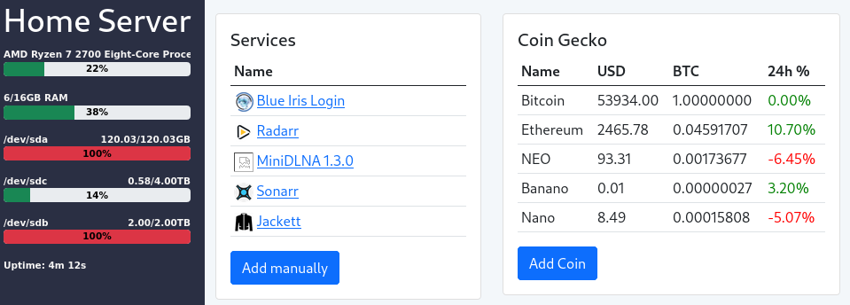

# Home Server
A Java/Spring Boot & React application for monitoring my home server.

  

## Features:

 * Services - Automatic detection of web services running on the server. Can also be manually added, if it is not correctly detecting a service.
 * Resource Monitor - Shows resource usage of CPU, RAM & storage devices and server uptime
 * Coin Gecko - View cryptocurrency prices using the Coin Gecko API

## System requirements

* Must have **java** installed

How to run?

* Download the latest .jar file from the releases section.
* Open a terminal and browse to the folder where the file is
* Type java -Dserver.port=80 -jar file.jar 
* Open a browser and navigate to http://localhost:port

# NOTE
Do not expose to the internet unless you put it behind a reverse-proxy with some authentication since this doesnt have any authentication/security implemented yet.
